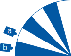

# Arduino Angle Encoder with Android UI

## Angle encoder

The angle encoder is a device which detects rotation movement and outputs it encoded with two signals.

The angle encoder has four cable ends which are assigned as follows:

| Cable Color | Assignment |
| :---------- | :--------- |
| brown       | +5V        |
| white       | GND        |
| yellow      | Channel A  |
| green       | Channel B  |

The direction of rotation is detected by a rotating disc inside as well as two sensors which can detect differences in brightness. The disc has spokes that alternate between light and dark, as shown in the graphic. These spokes are detected by the two sensors and a corresponding binary signal (e.g. 1 dark, 0 light) is output for each sensor via the yellow or green cable end.

If the disc rotates, the spokes below the sensors also change. This can be used to determine whether a rotation is taking place. To determine the direction of rotation, it must be noted which states are possible with this. Either sensor A or sensor B can detect a bright field (0) or a dark field (1). In addition, the sensors are arranged in such a way that both can also detect the same field. This opens up the following possibilities:

| Sensor A | Sensor B | Status |
| :------- | :------- | :----- |
| 0        | 0        | 0      |
| 0        | 1        | 1      |
| 1        | 0        | 2      |
| 1        | 1        | 3      |

### Precision

By measuring it can be determined that one complete rotation (360°) corresponds to 2000 detected steps, thus one measuring step corresponds to 0.18° of rotation.

## Android App

The Android App sports a simple UI only showing the rotation in degree (or alternatively Gon, decided by a toggle at the top) as well as in radian, the third value shows the detected rotation steps. At the bottom is a button to reset the current state to 0 degrees.

|          Phone          |          Tablet           |
| :---------------------: | :-----------------------: |
|  |  |

The app connects to an Arduino using a serial connection over USB. For this there is a "Establish Connection" button at the top.

The app reads the values provided by the Arduino and converts them to radian / degree before displaying it. It also sends reset commands to the Arduino to set the current state to 0 degrees.

## Ardunio Application

The application for the Arduino works pretty simple. It constantly checks the current signals provided by the encoder like described above and uses them to determine the direction of the rotation by comparing the current signal with the last signals. It then reduces or increases a step counter which is then published over a serial connection.
