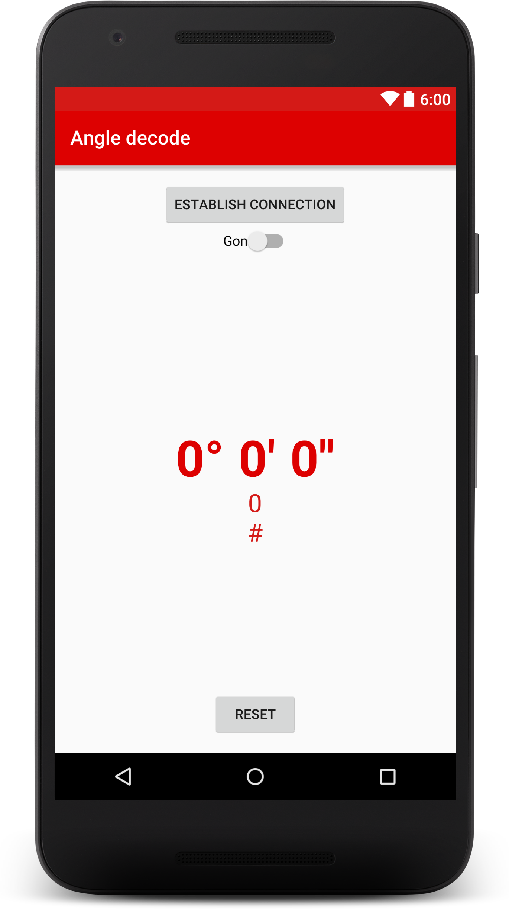
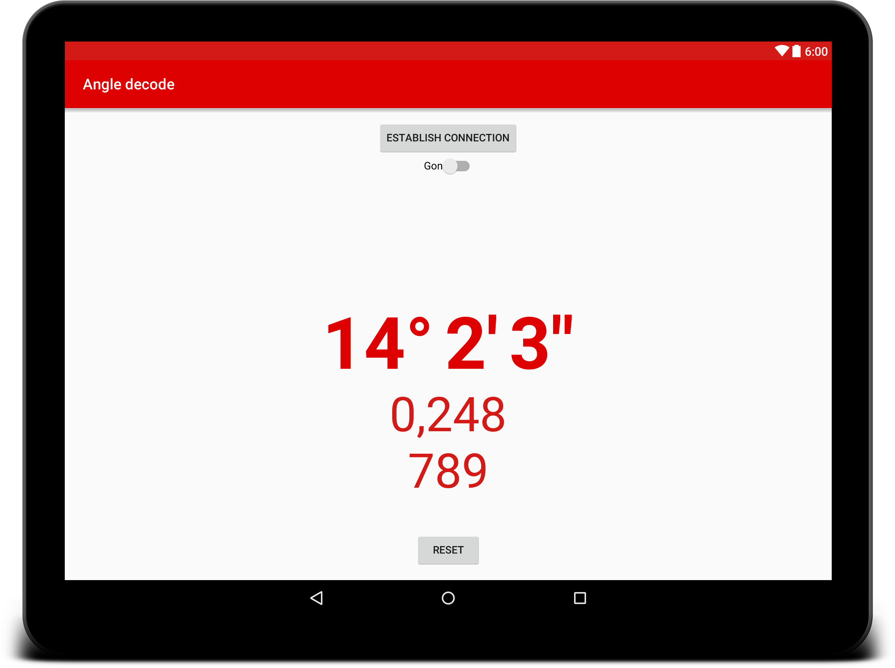

# Arduino Winkelkodierer mit Androidanzeige

## Winkelkodierer
Der Winkelkodierer ist ein Gerät welches Rotationen erkennt und über zwei Signale kodiert ausgibt.

Der Winkelkodierer hat vier Kabelenden die wie folgt belegt sind:

| Kabelfarbe | Belegung |
| :--------- | :------- |
| braun      | +5V      |
| weiß       | GND      |
| gelb       | Kanal A  |
| grün       | Kanal B  |

Die Erfassung der Rotationsrichtung erfolgt durch eine sich mitrotierende Scheibe im Inneren, sowie zwei Sensoren welche Helligkeitsunterschiede feststellen können. Die Scheibe besitzt, wie in der Grafik sichtbar, Speichen die abwechselnd Hell bzw. Dunkel sind. Diese Speichen werden von den beiden Sensoren erfasst und ein entsprechendes binäres Signal (z.B. 1 dunkel, 0 hell) wird je Sensor über das gelbe bzw. grüne Kabelende ausgegeben.

Dreht sich die Scheibe ändern sich folglich auch die Speichen unterhalb der Sensoren. Damit kann festgestellt werden ob eine Rotation stattfindet. Zur Bestimmung der Rotationsrichtung muss festgehalten werden welche Zustände hiermit möglich sind. Es kann entweder Sensor A oder Sensor B ein helles Feld (0) bzw. ein dunkles Feld (1) erfassen. Außerdem sind die Sensoren so angeordnet, dass auch beide das selbe Feld erfassen können. Hieraus ergeben sich folgende Möglichkeiten:

| Sensor A | Sensor B | Status |
| :------- | :------- | :----- |
| 0        | 0        | 0      |
| 0        | 1        | 1      |
| 1        | 0        | 2      |
| 1        | 1        | 3      |

### Genauigkeit

Durch Messen lässt sich feststellen das eine vollständige Umdrehung (360°) 2000 erfassten Schritten entspricht, somit entspricht ein Messschritt 0,18° Drehung.

## Android App

Die Android App verfügt über eine einfache Benutzeroberfläche, die nur die Drehung in Grad (oder alternativ in Gon, abhängig von einem Schalter oben) sowie in Bogenmaß anzeigt, der dritte Wert zeigt die erkannten Drehschritte. Unten befindet sich ein Knopf, um den aktuellen Zustand auf 0 Grad zurückzusetzen.

|        Phone        |        Tablet         |
| :-----------------: | :-------------------: |
|  |  |

Die App wird über eine serielle Verbindung über USB mit einem Arduino verbunden. Dazu gibt es oben eine Schaltfläche "Verbindung aufbauen".

Die App liest die vom Arduino gelieferten Werte und wandelt sie in Bogenmaß / Grad um, bevor sie angezeigt wird. Es sendet auch Reset-Befehle an den Arduino, um den aktuellen Zustand auf 0 Grad zu setzen.

## Ardunio Anwendung

Die Anwendung für den Arduino funktioniert recht einfach. Er überprüft ständig die vom Geber gelieferten Stromsignale (wie oben beschrieben) und ermittelt daraus die Drehrichtung durch Vergleich des aktuellen Signals mit den letzten Signalen. Er reduziert oder erhöht dann einen Schrittzähler, der dann über eine serielle Verbindung weitergegeben wird.